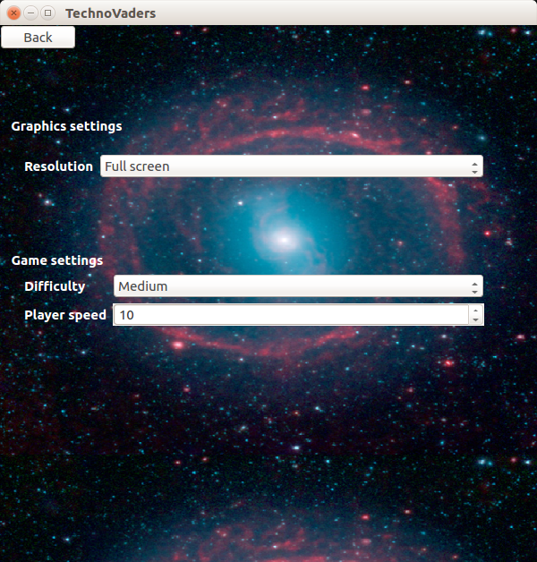
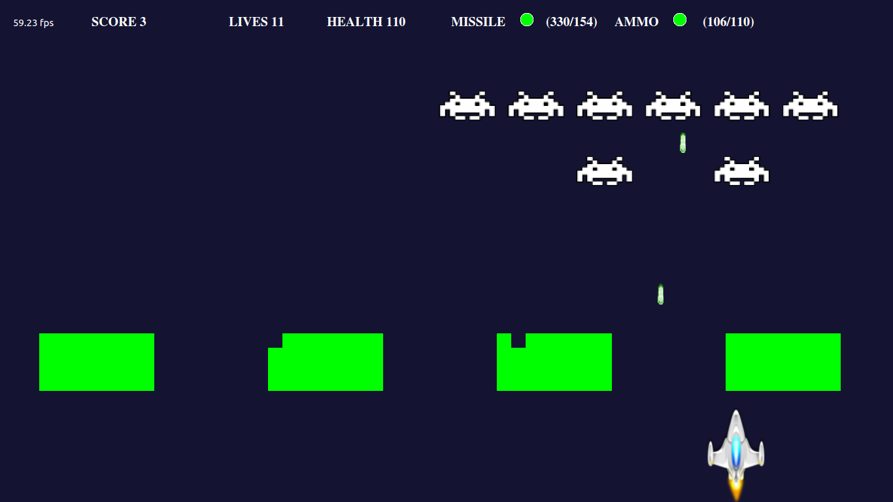
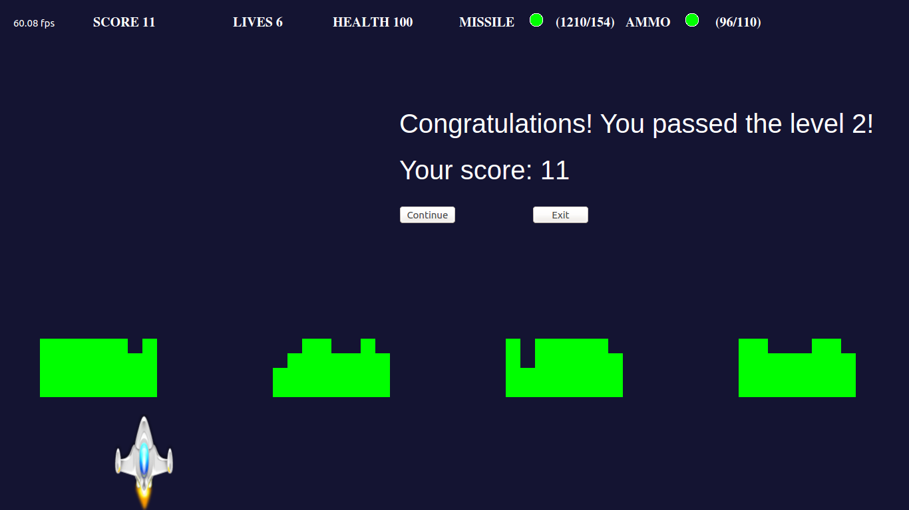

# TechnoVaders
Space Invaders game for [TechnoAtom](https://atom.mail.ru/) C++ course

Main contributors:  
[Roman Yakubovich](https://github.com/robbydrive)  
[Dmitry Pyrkin](https://github.com/GitDimONE)

What was used:
- C++11
- CMake
- Qt 5.5
    - Widgets module
    - OpenGL module
    - QtCreator 3.5
- Google Test
- JsonCPP

### Settings page

### Playing process

### Level finish

